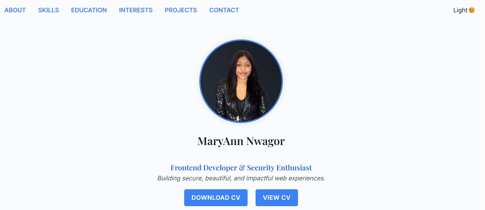

# MaryAnn Nwagor | Personal Portfolio Website

This is a modern, responsive, and lightweight personal portfolio built using **only HTML and CSS**. The website showcases my skills, background, achievements, projects, and contact information—all wrapped in a beautifully designed and mobile-first layout.

This project was built as part of a **Portfolio Building Hackathon Challenge**, with constraints to avoid libraries & frameworks. It demonstrates creative design and responsiveness using vanilla technologies.

---

## Table of Contents

- [Project Overview](#project-overview)
- [Features](#features)
- [Live Preview](#live-preview)
- [Screenshot](#screenshot)
- [Built With](#built-with)
- [How to Run Locally](#how-to-run-locally)
- [What I Learned](#what-i-learned)
- [Author](#author)
- [Acknowledgments](#acknowledgments)

---

## Project Overview

This portfolio serves as an online representation of my work as a **Frontend Developer** with a background in **Cybersecurity**. It includes sections like:

- Hero and About Me
- Education & Achievements
- Skills (with tooltips and interactive hover effects)
- Project Gallery
- Contact Form & Direct Contact Info
- Light/Dark Mode Support (Pure CSS)

---

## Features

Users can:

- ✅ Mobile-first responsive layout
- ✅ Pure HTML & CSS – No JS or external libraries
- ✅ Custom CSS Dark Mode Toggle
- ✅ Tooltip-enhanced Skills section
- ✅ Structured and accessible form with validation
- ✅ Creative and semantic UI design

---

## Live Preview
[View Project](https://maryann878.github.io/Portfolio/)
---

### Screenshot

#### Light Theme



---

## Built with

- Semantic **HTML5**
- Custom **CSS3**
- CSS Variables for theming
- Flexbox & CSS Grid
- No JavaScript or frameworks
- Fully accessible markup

---

## How to Run Locally

1. Clone this repo ```git clone  https://github.com/Maryann878/portfolio.git
2. Navigate into the project folder ```cd portfolio```
3. Open the '/docs' folder
4. Open 'index.html' in your browser 

---

### What I Learned
1. Crafting engaging UIs using only HTML and CSS
2. The power of CSS variables for light/dark themes
3. Creative layouting with Flexbox and Grid
4. Structuring HTML semantically for accessibility
5. How to communicate visually using tooltips and color contrasts

---

## Author

- Portfolio - [MaryAnn Nwagor](https://maryann878.github.io/Portfolio/)
- LinkedIn - @maryann-nwagor
- GitHub - @maryann878
- Email - [maryannnwagor@gmail.com](mailto:maryannnwagor@gmail.com)

---

## Acknowledgments
Huge thanks to PowerLearnProject(PLP) for this inspiration!
---

